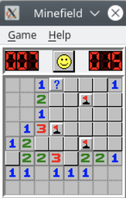
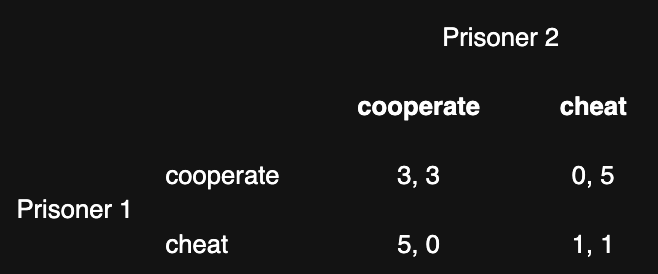
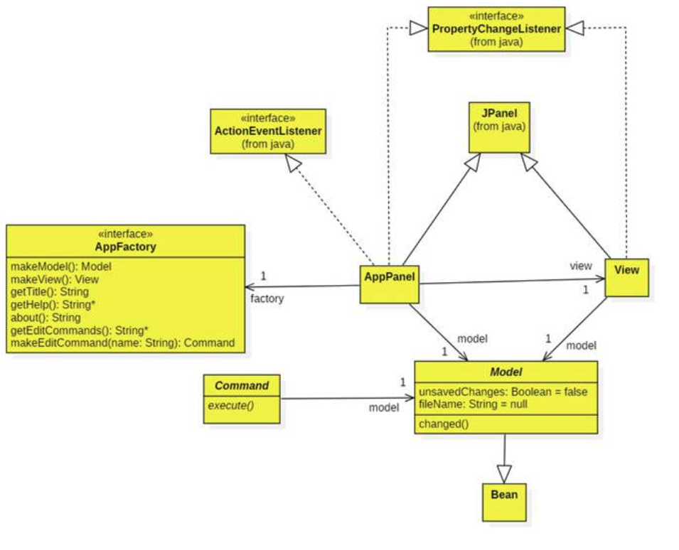
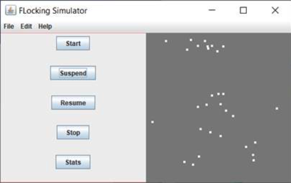
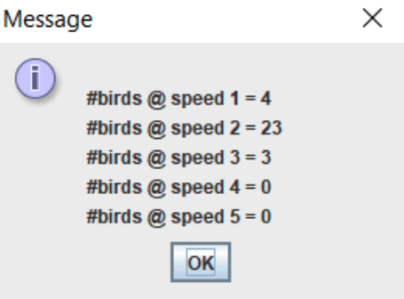
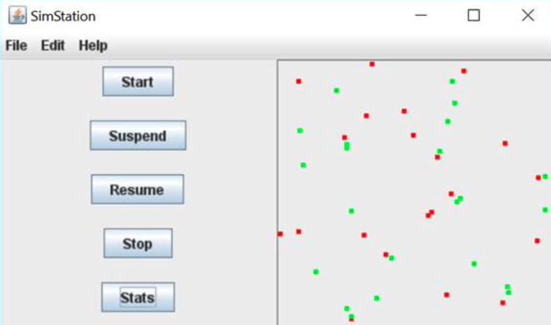
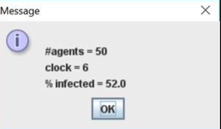

# MVC Applications
_A Java OOD (Object Oriented Design) Project_

> This project contains multiple java applications that implement the same mvc framework.

### __Idea__
To study the OOD (Object Oriented Design) in Java, especially the implementation of MVC design pattern, this project meant to implement applicaitons with using different java features (such as threading, ..) under the same mvc framework. Applications including:

- __Mine field__ is a popular game across computers and parties. This project is to build a java program that has mine field game features which based on an exsisting mvc framework. 

    
- __Simstation__ is a general simulator contains multiple simlulators for different purpose:
  - Prisoner Diliemma: to simulate prisoner diliema. Each prisoner has initial fitness socre, the score is changing while he play prisoner's dilemma with random neighbors. Each of them will keep using same strategy. The applicaiton will simulate which stategy would result to a win. 
    
  - Random Walk: Drunkers are walking on the street. Each drunker has random direction and speed towards to next position
  - Flocking Bird: Birds are initially flying in random direction. By the time pass, each bird would follow the nearest bird's direction. Eventually, all birds would fly as a group with similar motion. 
  - Plague: A virus is spreading in the community. Each resident has different chances to get infected and inmmute the virus. After a time period (activities of residents in the community), the results will show how the virus spread affecting the residents.

Although, each game by itself has unique functionalities that needs to further design and program, all features are implement or 'uses' the mvc framework. Which is also the purpose for this project - implementing specific featrues by a given framework.

### __Design__ 
By the rules of the game, player sponse at the left corner of the panel. One can decide to move forward to any avalivable direction. If the step is not on a mine, on adjacent grids, display number of mines around this location. Or else, the player steps on a mine, game over.

### __Implementation__

__mvc package__
contains basic mvc framework implementation including panel layout, app factory, and model.

__minefield __
implements mvc with customized functionalities:
- initialize mines across the field panel
- directional buttons on the control panel
- surrounding mine alert feature
- game rules

__Multi-Agent Architecture__

_FLocking Bird Implementation_

_Mine Field Implementation_

_Plague_

